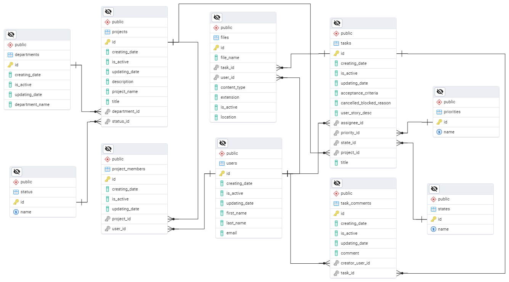
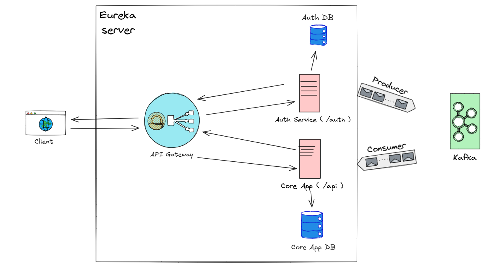

# Welcome to Labor Farm 

**Labor Farm** is a task management application that enables individuals or teams to organize and plan their work efficiently. Designed especially for teams, the application offers a comprehensive experience where user roles play a crucial role. There are four distinct roles available: **Project Group Manager**, **Project Manager**, **Team Leader,** and **Team Member**.

Each role has different levels of access to resources. After users register in the system, they are assigned roles by either a **Project Group Manager** or a **Project Manager**. Here are the details of each role:

## Role Definitions

-   **Project Group Manager**:
    
    -   Acts as the super user with full access to all resources.
        
-   **Project Manager**:
    
    -   Can assign roles.
        
    -   Has access to project member information and related resources.
        
    -   Has access to all lower-level roles.
        
-   **Team Leader**:
    
    -   Has the same privileges as a **Project Manager**.
        
-   **Team Member**:
    
    -   Can access task file information, task comments, and task-related resources.

## Technical Details
#### ****

The backend of **Labor Farm** is developed using **Spring Boot**, with **PostgreSQL** as the database and **Kafka** for asynchronous communication. Database operations are handled by **Spring Data JPA** and the **Hibernate ORM** framework. In addition to the **Core App**, the main application contains interrelated database tables.

#### ****

### **User Registration Flow**

1.  If a user is not registered in the system, they send a request to `/auth/register` or `/auth/register/admin`.
    
2.  The **API Gateway** forwards requests to unprotected endpoints in the **Auth Service**.
    
3.  The **Auth Service** saves the user's basic information and asynchronously publishes the user data to **Kafka**.
    
4.  When the event reaches the **Kafka listener service** in the **Core App**, detailed user information is stored in the system.
    
5.  The system returns the registered user details as a response to the client.
    

### **User Login Flow**

1.  The client sends the **email and password** to `/auth/login`.
    
2.  The **API Gateway** forwards the request to the **Auth Service**.
    
3.  The **Auth Service** verifies the credentials and generates a **JWT token**.
    
4.  The system returns the JWT token as a response to the client.
    

### **Role-Based Access and Protected Endpoints Flow**

1.  A logged-in client sends a request to a protected endpoint, including the **JWT token**.
    
2.  The **API Gateway** verifies the token and compares the user's role with the required role for the requested endpoint:
    
    -   If the role meets the required level, the **API Gateway** forwards the request to the target service. The response is sent back to the client via the same route.
        
    -   If the role is insufficient, the **API Gateway** returns a **403 Forbidden** response without forwarding the request.
        
    -   If the token cannot be verified using the **secret key**, the **API Gateway** returns a **401 Unauthorized** response to the client.


## Running the Application

1.  Start the **Docker container** by executing the following command  `docker-compose up -d` 
    
2.  Launch all **Spring Boot projects**.
    
3.  The **PostgreSQL** database tables will be automatically created when the application starts.
    ( If the required databases do not exist, it is recommended to manually create two databases with the specified names before running the application. )

# JSON Templates to Request End-Point on Postman

# **/auth:**

### **Login**

**GET** -> `http://localhost:8080/auth/login`

```
{
    "email": "PGMtestuser",
    "password": "PGMtestuser"
}
```

### **Register**

**POST** -> `http://localhost:8080/auth/register`

```
{
    "email": "PGMtestuser",
    "password": "PGMtestuser",
    "firstName": "PGMtestuser",
    "lastName": "PGMtestuser"
}
```

### **Register (ADMIN)**

**POST** -> `http://localhost:8080/auth/register/admin`

```
{
    "email": "PGMtestuser",
    "password": "PGMtestuser",
    "firstName": "PGMtestuser",
    "lastName": "PGMtestuser"
}
```

### **Add Role**

**POST** -> `http://localhost:8080/auth/role`

```
{
    "projectId": "49a98426-1b07-4495-89eb-703d55a20ba1",
    "userId": "fb7f1979-ec79-40a9-bc5e-2c5c3df71f59",
    "roleId": 4
}
```

### **Delete Role**

**DELETE** -> `http://localhost:8080/auth/role/{roleId}`

----------

# **/api/users:**

### **Get All Users**

**GET** -> `http://localhost:8080/api/users/v1`

### **Add User**

**POST** -> `http://localhost:8080/api/users/v1`

```
{
    "id": "2d8529e0-84c2-4b74-8885-f82974808bf4",
    "firstName": "test project member",
    "lastName": "test project member",
    "email": "test99@test.com",
    "createdAt": "2025-03-14",
    "updatedAt": null
}
```

### **Get User By Id**

**GET** -> `http://localhost:8080/api/users/v1/{userId}`

### **Update User**

**PUT** -> `http://localhost:8080/api/users/v1`

```
{
    "id": "666f7b0e-357b-43b3-a608-74f2bb2098d5",
    "firstName": "test990",
    "lastName": "test990",
    "email": "test990@test.com",
    "createdAt": "2025-03-14T00:00:00.000+00:00",
    "updatedAt": null
}
```

### **Delete User By Id**

**DELETE** -> `http://localhost:8080/api/users/v1/{userId}`

----------
 
 # **/api/departments:**

### **Get All Departments**

**GET** -> `http://localhost:8081/api/departments/v1`

### **Add Department**

**POST** -> `http://localhost:8080/api/departments/v1`

```
{
    "name": "After Sales Service",
    "createdAt": "2025-03-14"
}
```

### **Get Department By Id**

**GET** -> `http://localhost:8080/api/departments/v1/{departmentId}`

### **Delete Department**

**DELETE** -> `http://localhost:8080/api/departments/v1/{departmentId}`

### **Update Department**

**PUT** -> `http://localhost:8080/api/departments/v1`

```
{
    "id": "b96b8aa3-cbc5-44d7-b0a1-9bd8a66f33a8",
    "name": "After Sales Service"
}
```

----------

# **/api/projects:**

### **Get All Projects**

**GET** -> `http://localhost:8080/api/projects/v1`

### **Add Project**

**POST** -> `http://localhost:8080/api/projects/v1`

```
{
    "name": "Test1 PM",
    "title": "Test project 1 for PM testing",
    "description": "Test Test Test",
    "departmentId": "fa293452-dcb6-4378-b6d8-a26f3a9a2415",
    "statusId": 1
}
```

### **Get Project By Id**

**GET** -> `http://localhost:8080/api/projects/v1/{id}`

### **Update Project**

**PUT** -> `http://localhost:8080/api/projects/v1`

```
{
    "id": "cd8566bb-4dda-43e0-998b-3fcf117b1102",
    "name": "Test10",
    "title": "Test project 1 for testing.",
    "description": "Test Test Test10",
    "departmentId": "fa293452-dcb6-4378-b6d8-a26f3a9a2415",
    "statusId": 1
}
```

### **Delete Project**

**DELETE** -> `http://localhost:8080/api/projects/v1/{id}`

--------

### **Project Members API** (`/auth/projectmembers`)

#### **GET** - Get All Project Members

```
GET http://localhost:8080/api/projectmembers/v1
```

#### **GET** - Get Project Members By ProjectId

```
GET http://localhost:8080/api/projectmembers/v1/{projectId}
```

#### **GET** - Get User Memberships By UserId

```
GET http://localhost:8080/api/projectmembers/v1/user/{userId}
```

#### **GET** - Check User Existence in Project

```
GET http://localhost:8080/api/projectmembers/v1/check/user
```

##### Request Body:

```
{
    "projectId": "b8113f26-28d5-4c74-b368-ca79d4093d30",
    "userId": "2d8529e0-84c2-4b74-8885-f82974808bfc"
}
```

#### **POST** - Add Project Member

```
POST http://localhost:8080/api/projectmembers/v1
```

##### Request Body:

```
{
    "projectId": "a9a1cb48-a3f6-4b87-885c-8f2947964e41",
    "userId": "2d8529e0-84c2-4b74-8885-f82974808bfc"
}
```

#### **DELETE** - Delete Project Member

```
DELETE http://localhost:8080/api/projectmembers/v1/{id}
```

----------

### **Tasks API** (`/api/tasks`)

#### **GET** - Get All Tasks

```
GET http://localhost:8080/api/tasks/v1
```

#### **GET** - Get Task By Id

```
GET http://localhost:8080/api/tasks/v1/{id}
```

#### **GET** - Get Tasks By State Id

```
GET http://localhost:8080/api/tasks/v1/state/{id}
```

#### **GET** - Get Tasks By Priority Id

```
GET http://localhost:8080/api/tasks/v1/priority/{id}
```

#### **GET** - Get Tasks By Project Id

```
GET http://localhost:8080/api/tasks/v1/project/{id}
```

#### **GET** - Get Tasks By User Id

```
GET http://localhost:8080/api/tasks/v1/user/{id}
```

#### **POST** - Add Task

```
POST http://localhost:8080/api/tasks/v1
```

##### Request Body:

```
{
    "userStoryDescription": "Test description1919",
    "acceptanceCriteria": "Test criterias1919",
    "cancelledOrBlockedReason": "",
    "assigneeId": "901c62ca-68ba-4742-a9f8-212290f847e7",
    "projectId": "b8113f26-28d5-4c74-b368-ca79d4093d31",
    "stateId": 1,
    "priorityId": 1
}
```

#### **DELETE** - Delete Task

```
DELETE http://localhost:8080/api/tasks/v1/{id}
```

#### **PUT** - Update Task

```
PUT http://localhost:8080/api/tasks/v1
```

##### Request Body:

```
{
    "id": "0c078d01-e412-4ea8-b45c-6affcb1963f4",
    "userStoryDescription": "Test description111",
    "acceptanceCriteria": "Test criterias111",
    "cancelledOrBlockedReason": "test reason",
    "assigneeId": "901c62ca-68ba-4742-a9f8-212290f847e7",
    "projectId": "b8113f26-28d5-4c74-b368-ca79d4093d31",
    "stateId": 3,
    "priorityId": 2
}
```

----------

### **Task Comments API** (`/auth/taskcomments`)

#### **POST** - Add Task Comment

```
POST http://localhost:8080/api/taskcomments/v1
```

##### Request Body:

```
{
    "taskId": "0c078d01-e412-4ea8-b45c-6affcb1963f4",
    "creatorUserId": "901c62ca-68ba-4742-a9f8-212290f847e7",
    "comment": "test 2 test"
}
```

#### **GET** - Get Task Comments

```
GET http://localhost:8080/api/taskcomments/v1/{taskId}
```

#### **PUT** - Update Comment

```
PUT http://localhost:8080/api/taskcomments/v1
```

##### Request Body:

```
{
    "id": "be790362-0f24-4f0f-8a31-7d08ca3135ed",
    "taskId": "0c078d01-e412-4ea8-b45c-6affcb1963f4",
    "creatorUserId": "901c62ca-68ba-4742-a9f8-212290f847e7",
    "comment": "DENEME"
}
```

#### **DELETE** - Delete Comment

```
DELETE http://localhost:8080/api/taskcomments/v1/{commentId}
```

----------

### **File Infos API** (`/auth/fileinfos`)

#### **GET** - Get All File Infos

```
GET http://localhost:8080/api/fileinfos/v1
```

#### **GET** - Get Infos By Task Id

```
GET http://localhost:8080/api/fileinfos/v1/{taskId}
```

#### **POST** - Add File Info

```
POST http://localhost:8080/api/fileinfos/v1
```

##### Request Body:

```
{
    "keyname": "file",
    "keytype": "file",
    "value": "upload the file here"
},
{
    "keyname": "metadata",
    "keytype": "text",
    "value": {
        "userId": "901c62ca-68ba-4742-a9f8-212290f847e7",
        "taskId": "58803b47-bf59-44d8-9a09-9f99165e2d6e"
    }
}
```

#### **DELETE** - Delete File Info

```
DELETE http://localhost:8080/api/fileinfos/v1/{id}
```

----------
